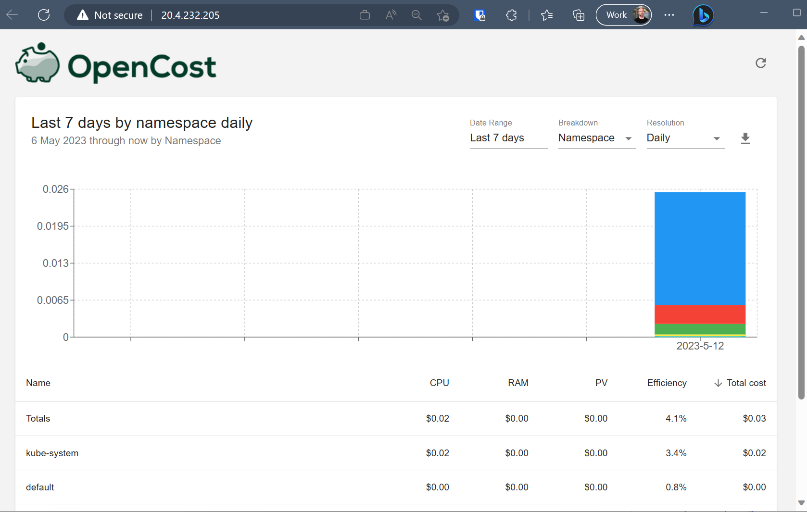
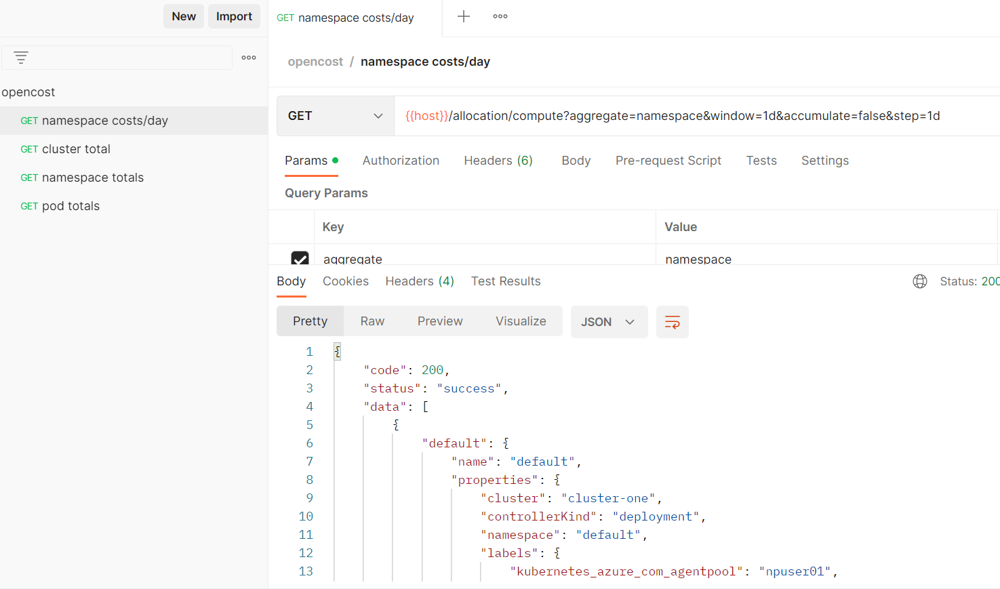

# OpenCost

This project is an end to end demonstration of using OpenCost with the Azure Kubernetes Service.

## Getting Started

This sample repo uses Bicep IaC to;

1. Create a new AKS cluster
1. Installs Prometheus into the cluster
1. Installs OpenCost into the cluster using a Helm chart
1. Installs sample workloads to provide additional data.
1. Installs an Nginx ingress controller to make the OpenCost Dashboard internet accessible.

> An internet accessible Dashboard is great for quickly letting you and your team see what's available, but it is not a secure configuration.

### Prerequisites

- [Azure CLI](https://learn.microsoft.com/cli/azure/install-azure-cli)
- [Postman](https://www.postman.com/downloads/)

### Installation

1. git clone https://github.com/Azure-Samples/opencost.git
2. cd opencost
3. az group create -g aks -l eastus
4. az deployment group create -g aks -f main.bicep

### Using OpenCost

#### Dashboard

We have allowed open public access to the OpenCost dashboard for ease of demonstration. To access the dashboard, we'll use the IP address.

To find out the IP address that your dashboard is exposed on, go to the Azure Portal, open the Azure Kubernetes Service and browse to the Services and Ingresses section. Click on the External IP listed next to the nginx-ingress resource.

> If you don't have permission to view Services and Ingresses, then give yourself the correct RBAC permissions on the AKS Cluster through the Access Control section. Give yourself the `Azure Kubernetes Service RBAC Cluster Admin` role.



From the dashboard you can explore the simple views of the data and initiate an export.

#### API

A [Postman collection](https://raw.githubusercontent.com/opencost/opencost/develop/docs/opencost.postman_collection.json) is available to make querying the API much easier, read more about it [here](https://www.opencost.io/docs/api).

As we've only exposed the Dashboard publicly, to access the API we'll create tunnel to the Cluster using some simple commands.

```bash
#auth with the AKS cluster
az aks get-credentials -n aks-costdemo -g aks --admin

#open a connection to the cluster service on the port the API is exposed on
kubectl port-forward --namespace opencost service/opencost 9003
```

You can now navigate the Postman collection for the data.



## Resources

- Link to [OpenCost](https://www.opencost.io/)
